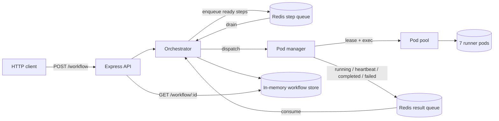
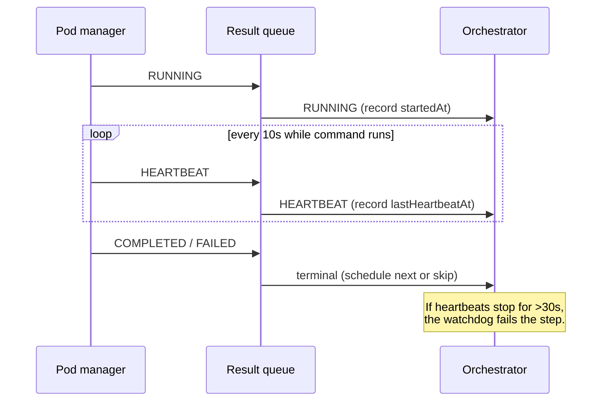

# Runexus

A small but complete orchestration engine that runs a DAG of shell commands across a pool of Kubernetes pods. You submit a workflow over HTTP, the engine resolves dependencies, dispatches each ready step to a free runner pod, streams lifecycle events back through Redis, and tracks every step to a terminal state.

The interesting part is what happens when things take a while or go wrong: long-running steps emit a heartbeat every few seconds, and a watchdog fails any step whose pod stops responding so a workflow never hangs.

## System at a glance

A control plane decides what runs and tracks state; a data plane runs the commands in pods. The two halves communicate only through Redis queues.



While a step runs, its pod pulses on a fixed interval; if the pulses stop, a watchdog fails the step so the workflow can't hang.



## Contents

- [What it does](#what-it-does)
- [Architecture](#architecture)
- [How a step flows through the system](#how-a-step-flows-through-the-system)
- [Liveness: heartbeats and the watchdog](#liveness-heartbeats-and-the-watchdog)
- [Failure handling](#failure-handling)
- [Tech stack](#tech-stack)
- [Getting started](#getting-started)
- [HTTP API](#http-api)
- [Configuration](#configuration)
- [Project layout](#project-layout)

## What it does

- **DAG execution.** A workflow is a set of steps, each with a shell `command` and an optional `dependsOn` list. A step runs only after all of its dependencies have completed.
- **Parallel dispatch.** Independent steps run concurrently, bounded only by the number of runner pods in the pool. When the pool is saturated, steps wait in a queue and pick up a pod as soon as one frees.
- **Pod pooling.** Runner pods are warmed up ahead of time and leased per step, so the cluster never has to schedule a pod on the critical path.
- **Liveness heartbeats.** While a command runs, its pod emits a pulse on a fixed interval. Missing pulses mean the pod died, not that the command is slow.
- **Deterministic termination.** Every workflow reaches `completed` or `failed`. A failed or crashed step skips everything downstream of it instead of leaving the graph stuck.
- **Input validation.** Submitted graphs are checked for duplicate ids, dangling dependencies, and cycles before any step is scheduled.

## Architecture

The system is split into a control plane (decides what runs and tracks state) and a data plane (actually runs commands in pods). The two halves talk only through Redis queues, which keeps the orchestrator's bookkeeping isolated from the messy realities of executing in a cluster. See the [diagram at the top](#system-at-a-glance) for the full picture.

Responsibilities are deliberately narrow:

| Component | Responsibility |
| --- | --- |
| **Express API** (`backend/server.ts`) | Accept and validate workflows, expose status and pool endpoints. |
| **Orchestrator** (`backend/orchestrator.ts`) | The brain. Owns workflow state, schedules ready steps, consumes result events, runs the liveness watchdog. **The only writer of step status.** |
| **DAG resolver** (`backend/dag.ts`) | Pure functions: which steps are ready, what to skip on failure, is the graph valid. |
| **Pod manager** (`pod-manager/pod-manager.ts`) | Run one step in a leased pod and report its lifecycle. Never touches workflow state. |
| **Pod pool** (`k8s/pod-pool.ts`) | Discover runner pods, lease/release them, exec commands, probe liveness. |
| **Queues** (`queue/*`) | Redis-backed FIFO for pending steps and for result events. |
| **Workflow store** (`backend/workflow-store.ts`) | In-memory map of workflow id to its current state. |

The key invariant: **the pod manager only ever observes and reports; the orchestrator decides.** State transitions live in exactly one place, which is what makes the event flow easy to reason about.

## How a step flows through the system

1. A client submits a workflow. The orchestrator validates the graph, stores every step as `PENDING`, then enqueues the steps with no dependencies as `QUEUED`.
2. The drain loop pops a queued step and hands it to the pod manager.
3. The pod manager leases a free pod, reports `RUNNING`, and starts the command.
4. The orchestrator consumes the `RUNNING` event and marks the step running.
5. When the command finishes, the pod manager reports `COMPLETED` (with stdout and exit code) or `FAILED`, then releases the pod.
6. On `COMPLETED`, the orchestrator re-resolves the DAG and enqueues any steps that just became unblocked. The cycle repeats until every step is terminal.
7. Once all steps are terminal, the workflow is marked `completed` or `failed`.

Because dispatch is fire-and-forget, steps that are ready at the same time run in parallel across the pool.

## Liveness: heartbeats and the watchdog

A command like `sleep 30` or a slow build is indistinguishable, from the outside, from a pod that crashed the moment it started: both produce silence. Heartbeats remove that ambiguity.

While a step runs, the pod manager probes the pod's status on a fixed interval (10s by default) and pushes a `HEARTBEAT` event for each successful probe. The orchestrator records the timestamp of the last heartbeat on the step.

A watchdog scans running steps every few seconds. If a step has gone longer than `interval × grace` (30s by default) without a heartbeat, the orchestrator treats its pod as dead, marks the step `FAILED`, and skips its dependents. This is what guarantees a workflow can't hang on a pod that quietly disappeared. The [sequence diagram at the top](#system-at-a-glance) traces the full running → heartbeat → terminal path.

Terminal status is final: a late heartbeat that races a watchdog timeout is ignored, so a step can never flip back out of a terminal state.

## Failure handling

- **A step exits non-zero.** It's marked `FAILED` and every step transitively downstream is marked `SKIPPED`.
- **A pod dies mid-step.** The exec fails (or, if it goes fully silent, the watchdog catches it). Same outcome: `FAILED`, dependents skipped.
- **The pool is saturated.** Dispatch raises `NO_POD_AVAILABLE`; the step is requeued and retried once a pod frees.
- **An invalid graph is submitted.** The API rejects it with `400` before anything runs.

Skipping downstream work is a breadth-first walk over the dependency edges, so a failure deep in a wide graph cleanly prunes everything that can no longer run.

## Tech stack

- **[Bun](https://bun.sh)** — runtime and TypeScript execution, no build step.
- **TypeScript** — `strict` mode throughout.
- **Express 5** — HTTP API.
- **Redis** (via **ioredis**) — the step and result queues, using blocking `BRPOP` so consumers park instead of polling.
- **Kubernetes** (via **kind** locally) — the runner pods, deployed as a `StatefulSet` so pod names are stable (`runner-0` … `runner-6`).
- **@kubernetes/client-node** — pod discovery and liveness checks; command execution shells out to `kubectl exec` asynchronously.

## Getting started

### Prerequisites

- Docker
- [kind](https://kind.sigs.k8s.io/)
- kubectl
- Bun
- Redis

### Run it

```bash
# 1. Install dependencies
bun install

# 2. Start Redis
docker run -d --name workflow-redis -p 6379:6379 redis
# (already created it once? `docker start workflow-redis`)

# 3. Create the kind cluster and 7 runner pods
chmod +x k8s/setup.sh
./k8s/setup.sh

# 4. Start the server
bun run dev
```

Confirm the pods are up:

```bash
kubectl get pods -n workflow-runner   # runner-0 .. runner-6, all Running
curl http://localhost:3000/pods       # {"total":7,"available":7,"leased":[]}
```

### Submit a workflow

```bash
curl -X POST http://localhost:3000/workflow \
  -H "Content-Type: application/json" \
  -d '{
    "workflowId": "wf-123",
    "steps": [
      { "id": "A", "command": "echo hello" },
      { "id": "B", "command": "ls /",   "dependsOn": ["A"] },
      { "id": "C", "command": "pwd",    "dependsOn": ["A"] },
      { "id": "D", "command": "date",   "dependsOn": ["B", "C"] }
    ]
  }'
```

`A` runs first; `B` and `C` run in parallel once `A` completes; `D` runs after both. Poll the status:

```bash
curl http://localhost:3000/workflow/wf-123
```

To watch heartbeats in action, give a step a long command (`"command": "sleep 25"`) and poll the status while it runs — `lastHeartbeatAt` advances every 10s until the step completes.

## HTTP API

| Method | Path | Description |
| --- | --- | --- |
| `POST` | `/workflow` | Submit a workflow. Returns `202` with `{ workflowId, status }`, or `400` for an invalid graph. |
| `GET` | `/workflow/:id` | Workflow status plus per-step status, pod, exit code, stdout, error, and heartbeat timestamps. `404` if unknown. |
| `GET` | `/pods` | Pool occupancy: total, available, and leased pod ids. |
| `GET` | `/healthz` | Liveness probe for the server itself. |

## Configuration

All settings have sensible defaults; override them with environment variables (see `.env.example`).

| Variable | Default | Purpose |
| --- | --- | --- |
| `PORT` | `3000` | HTTP port. |
| `REDIS_HOST` / `REDIS_PORT` | `localhost` / `6379` | Redis connection. |
| `REDIS_QUEUE_PREFIX` | `workflow:<pid>` | Namespaces the Redis keys; set it to share queues across processes. |
| `KUBE_NAMESPACE` | `workflow-runner` | Namespace the runner pods live in. |
| `KUBE_POD_LABEL` | `app=runner` | Label selector used to discover runners. |
| `HEARTBEAT_INTERVAL_MS` | `10000` | How often a running step pulses. |
| `HEARTBEAT_GRACE_BEATS` | `3` | Missed pulses tolerated before a step is declared dead. |
| `LIVENESS_SCAN_INTERVAL_MS` | `5000` | How often the watchdog scans running steps. |

## Project layout

```
src/
  index.ts                 # Boot: connect Redis, warm the pool, start the API
  backend/
    server.ts              # Express routes
    orchestrator.ts        # Scheduling, event handling, liveness watchdog
    dag.ts                 # Ready-step resolution, skip propagation, validation
    workflow-store.ts      # In-memory workflow state
  pod-manager/
    pod-manager.ts         # Run a step in a pod, emit lifecycle + heartbeats
  k8s/
    pod-pool.ts            # Discover, lease, exec, probe pods
  queue/
    redis-client.ts        # Shared ioredis connection
    step-queue.ts          # Pending steps (FIFO)
    result-queue.ts        # Lifecycle events
  types/
    workflow.ts            # Shared types
k8s/
  namespace.yaml           # workflow-runner namespace
  rbac.yaml                # ServiceAccount + RBAC for pod exec
  runner-pod.yaml          # StatefulSet of 7 runners
  setup.sh                 # One-shot cluster bring-up
```

## Useful commands

```bash
# Free port 3000 if a previous server is still bound
lsof -ti:3000 | xargs kill -9 2>/dev/null || true

# Restart Redis
docker restart workflow-redis

# Rebuild the cluster from scratch
kind delete cluster --name workflow-cluster && ./k8s/setup.sh
```
